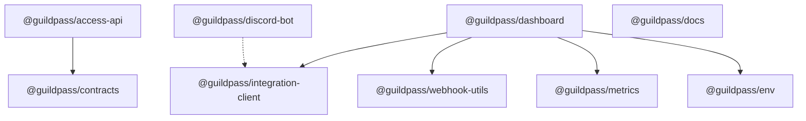

# Architecture

The internal workspace dependencies of the `GuildPass` monorepo are visualized below. 
There are no circular dependencies.

## Known Discrepancies
- `@guildpass/discord-bot` specifies its dependency on `@guildpass/integration-client` using a `file:../../packages/integration-client` resolution rather than `workspace:*`. This is intentional or legacy, but effectively functions as an internal dependency.
